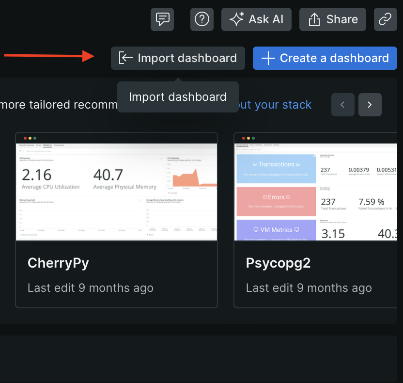
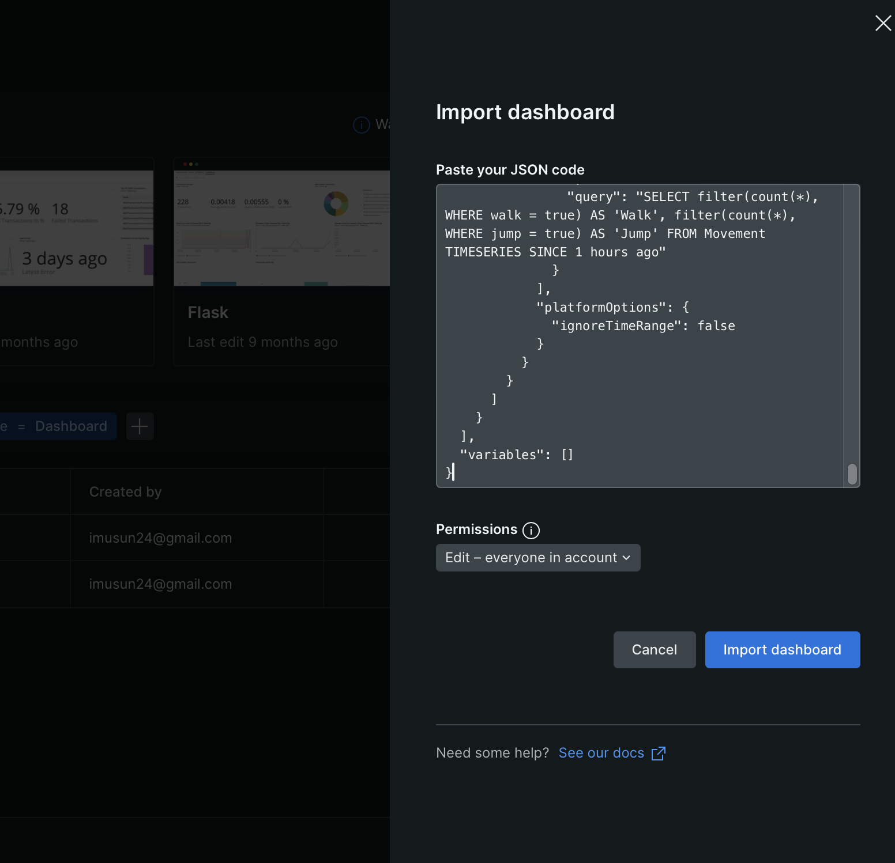

# DAVE

## 📁 Project Folder Breakdown: `DATADAVECHALLENGE_DEVREL/`

---

### 📁 `venv/`

- **Local virtual environment** created with `python -m venv venv`.
- Includes:
    - `bin/`: Executables and scripts like `activate`
    - `lib/`: Installed Python packages
    - `include/`: Header files for packages
- **Important**: Keeps dependencies isolated from your global Python install.

---

### 📄 `.python-version`

- Created by `pyenv`.
- Tells the project to use Python **3.10.13** (or whatever version you installed with pyenv).
- Ensures consistent behavior across machines.

---

### 🧠 `classes.py`

- Defines core game classes such as:
    - `Player`, `Enemy`, `Item`, `Bullet`, etc.
- Contains object-oriented logic (e.g., health, movement, collisions).
- A good place to instrument state transitions or score calculations.

---

### 🧩 `functional.py`

- Contains utility or helper functions used across the game.
- Example: pathfinding, level generation, calculations.
- Used for stat handling or procedural events.

---

### 🎮 `game.py`

- **The heart of the game.**
- Runs the main game loop using Pygame.
- This is where you:
    - Handle rendering and input
    - Track scores, events, levels
    - **Add New Relic instrumentation!**

---

### 📊 `game_stats.json`

- JSON template to set up your custom **New Relic dashboard**.
- Replace `"YOUR_ACCOUNT_ID"` with your actual ID.
- Contains widgets that visualize.
- Import this into New Relic’s dashboard editor

---

### 📄 `newrelic.ini`

- Configuration file for the **New Relic Python Agent**.
- Must include your:
    - `license_key`
    - `app_name`
    - Optional: `audit_log_file` for tracking outgoing events
- **Linked to your environment** via:
    
    ```bash
    
    export NEW_RELIC_CONFIG_FILE=/path/to/newrelic.ini
    ```
    

---

### 📄 `newrelic-audit.log`

- Custom log (only appears if configured in `newrelic.ini`).
- Logs every event sent to New Relic.
- Crucial for debugging: shows whether your events were actually dispatched.

---

### 📄 `requirements.txt`

- Lists all Python dependencies.

## ✅ Dangerous Dave Game Setup with New Relic Instrumentation

### 📘 Create a New Relic Account (Before You Start)

To instrument and monitor the game, you'll need a New Relic account. If you don’t already have one:

- **Sign up here**: [https://newrelic.com/signup](https://newrelic.com/signup) *(no credit card required)*
- Or follow this video walkthrough to create your account:
    
    📺 [Watch on YouTube](https://www.youtube.com/watch?v=sFt1Tx5qPRU)
    

Once your account is ready, you'll get:

- Your **Account ID**
- Your **License (Ingest) Key - Create a new one!!**
    
    You’ll need both of these during the instrumentation and dashboard setup.
    

### 1. **Install Prerequisites**

- **Install Python 3.10** (required, as newer versions may not work):
    
    ```bash
    brew install pyenv
    pyenv install 3.10.13
    pyenv local 3.10.13
    ```
    
- **Verify Python version**:
    
    ```bash
    python --version
    ```
    

---

### 2. **Set Up Virtual Environment**

- Create and activate virtual environment:
    
    ```bash
    python3 -m venv venv
    source venv/bin/activate
    ```
    
- Upgrade pip and install dependencies:
    
    ```bash
    pip install --upgrade pip
    pip install -r requirements.txt
    ```
    

---

### 3. **Install & Configure New Relic**

- Generate `newrelic.ini` using your **New Relic license key**:
    
    ```bash
    newrelic-admin generate-config <YOUR_LICENSE_KEY> newrelic.ini
    ```
    
- **Set the environment variable** so Python can find the config:
    
    ```bash
    export NEW_RELIC_CONFIG_FILE=/absolute/path/to/your/newrelic.in
    ```
    
- (Optional) Add the export command to your shell profile (`.bashrc`, `.zshrc`) to persist it.
- **Verify it’s working**:
    
    ```bash
    cat $NEW_RELIC_CONFIG_FILE
    ```
    

---

### 4. **Update Config Files with Your Account Info**

- In both `game.py` and `newrelic.ini`, update:
    - Your **New Relic Account ID**
    - (If required) License key in the `.ini`

---

### 5. **Run the Game**

- Launch the instrumented game:
    
    ```bash
    python game.py
    ```
    

---

### 6. **Setup the Dashboard **

- Then, [import the dashboard](https://docs.newrelic.com/docs/query-your-data/explore-query-data/dashboards/introduction-dashboards/#dashboards-import) into your New Relic account via the UI.
- Click on Import Dashboard, and paste your Updated JSON Code.




### ✅ **Primary Custom Events & Their Datapoints**

These are recorded using `newrelic.agent.record_custom_event()` in your game:

### 1. **GameComplete / GameIncomplete**

- `current_level`
- `player_score`

### 2. **LevelUp**

- `current_level`
- `player_score`

### 3. **LivesUsed**

- `cause_of_death` (e.g., fire, water, tentacles)

### 4. **LivesLeft**

- `current_level`

### 5. **CollectedItem**

- `item.id`
- `item.type`
- `item.score` (aggregated in dashboards)

### 6. **LevelRAMUsage**

- `level`
- `ram_used_mb`

### 7. **LevelCompletionTime**

- `level`
- `duration_sec`

### 8. **LevelRetry**

- `current_level`
- `retry_count`

### 9. **Movement**

- `walk`
- `jump`

### ✅ Summary of All Datapoints for Instrumentation

| Category | Datapoints |
| --- | --- |
| Score | `player_score`, `max(player_score)` |
| Levels | `current_level`, `level`, `max(current_level)` |
| Items | `item.id`, `item.type`, `item.score`, `# Collected`, `Total Value` |
| Deaths | `cause_of_death`, `LivesLeft` count per level |
| RAM Usage | `ram_used_mb` per level |
| Completion Time | `duration_sec` per level |
| Retries | `retry_count` per level |
| Movement | `walk`, `jump` |
| Metadata/Session | `GameComplete`, `GameIncomplete`, `timestamp`, `appName`, `accountId`  |

## ⚠️ Common Issues & Fixes for New Relic Instrumentation

### 1. ❌ **Incorrect Python Version**

- **Issue**: Game or New Relic agent might fail to run or behave inconsistently with Python ≥ 3.11.
- **Fix**:
    
    Use Python **< 3.10** (e.g., 3.10.13) using `pyenv`:
    
    ```bash
    bash
    CopyEdit
    brew install pyenv
    pyenv install 3.10.13
    pyenv local 3.10.13
    
    ```
    

---

### 2. ❌ **Hard to Debug What Events Are Triggered**

- **Issue**: It's unclear which events are firing or if they're being sent.
- **Fix**:
    - Use Python's built-in **`logging`** module liberally during instrumentation:
        
        ```python
        python
        CopyEdit
        import logging
        logging.basicConfig(level=logging.INFO)
        logging.info(f"Sending event: {event_type} - {params}")
        
        ```
        
    - Helps verify data structures and identify bugs early.

---

### 3. ❌ **Events Not Appearing in Dashboard**

- **Issue**: Events aren't visible in your New Relic dashboard.
- **Fixes**:
    - **Enable event audit logging** in your `newrelic.ini` file:
        
        ```
        ini
        CopyEdit
        audit_log_file = /absolute/path/to/newrelic-audit.log
        ```
        
        This will log every event being sent.
        
    - Check this file to confirm that events are being **dispatched** properly.

---

### 4. ❌ **Movement Events Broke Other Events**

- **Issue**: After adding `Movement` events (walk/jump), other events stopped triggering.
- **Cause**: Movement events were **too frequent** (~800+ per minute), hitting New Relic’s **event rate limit**(1000/min).
- **Fix**:
    - **Throttle** movement-related events:
        - Use a **timer** or **event deduplication** strategy to limit how often they’re sent.
        - For example, log movement once every X seconds or after a state change.
    
    Batch multiple movement flags into one event if possible.
    

---

### 5. ❌ **Dashboard Chart Not Displaying Correctly**

- **Issue**: A chart/widget doesn't show expected data.
- **Fixes**:
    - Edit the dashboard directly in New Relic UI and **inspect the NRQL query**.
    - Try using **Query AI** in New Relic to help auto-correct or refine NRQL.
    - Use **`SINCE` and `TIMESERIES`** clauses appropriately to debug time-sensitive queries.

---

## ✅ Pro Tips:

- Keep a **log window open** while playing the game to monitor live event logs.
- If you're testing locally, avoid overwhelming the agent with low-value telemetry (like every pixel step or frame).
- Ensure **unique and consistent attribute naming** (`player_score`, `current_level`, etc.) for NRQL queries to work.

---

New Relic Account ID - **6750116**
Email Address - imusun24@gmail.com